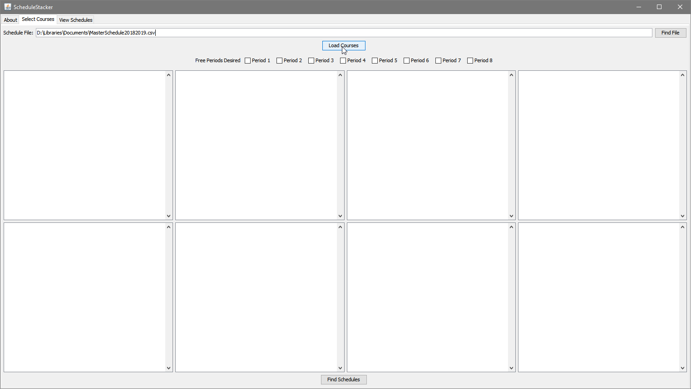
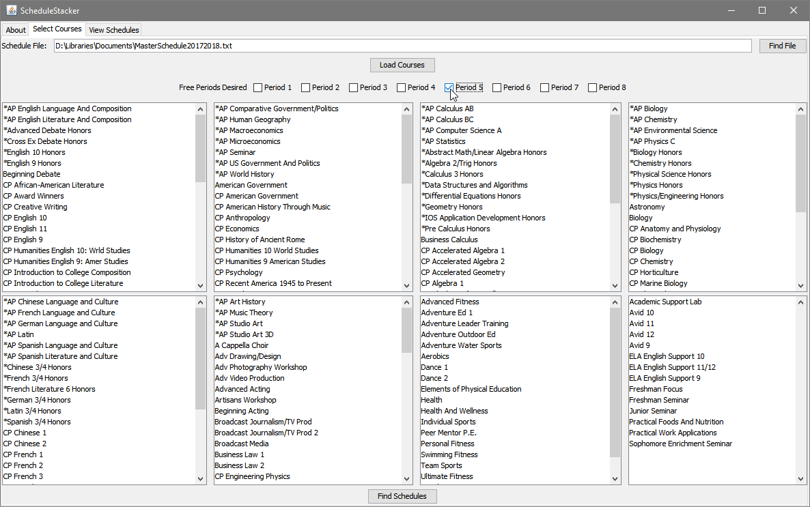
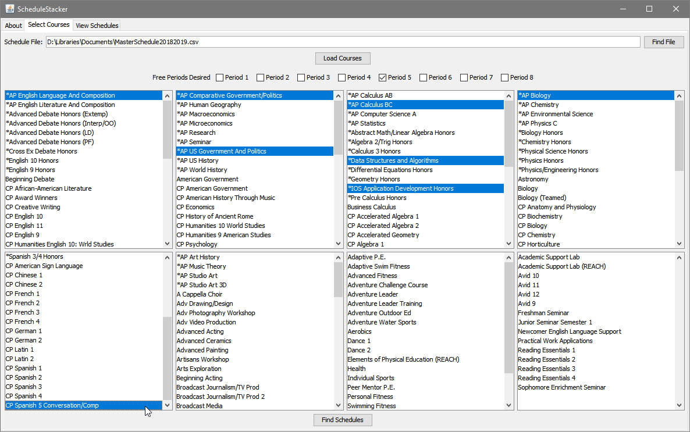
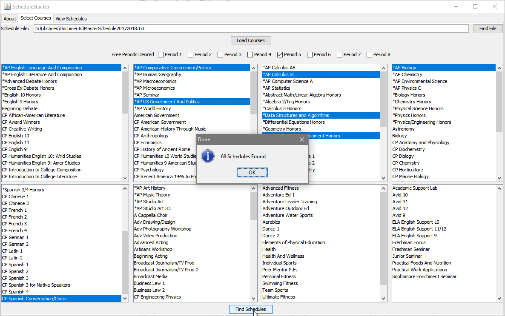
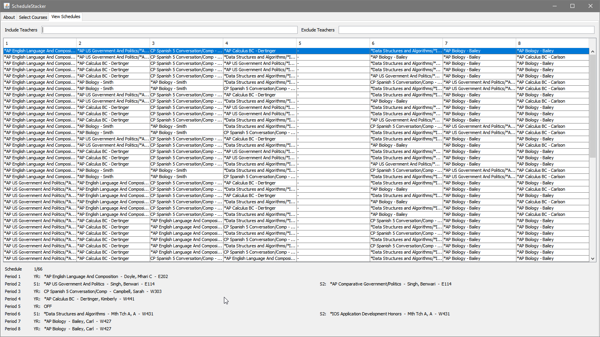

ScheduleStacker is tool for finding all permutations of course schedules to aid in the self-registration process.

### Downloads

#### Latest (v1.0.0)

ScheduleStacker: [v1.0.0](https://github.com/Coreball/ScheduleStacker/releases/download/v1.0.0/ScheduleStacker_v1.0.0.jar)

Master Schedule: [2017-2018](https://github.com/Coreball/ScheduleStacker/releases/download/v1.0.0/MasterSchedule20172018.txt)

#### Older Versions

There are none

### Usage

1. Navigate to the "Select Courses" tab and select a file containing the readable master schedule (will have download for this, it is NOT the PDF on the school website) and load it.

2. Select your desired off periods. These are the off periods that you _like, totally need_. Depending on your situation, this could either be just your lunch period or your lunch period and another off that you'd like. If you have a one-and-a-half period class like AP Biology, do not treat the half period as a desired off period.

3. Select your desired courses. CTRL-Click to select multiple in the same category or to deselect a course.

4. Press "Find Schedules" to generate the schedules.

5. Switch to "View Schedules" and deeply analyze your future

### About

[GitHub Repository](https://github.com/Coreball/ScheduleStacker)

Created by Changyuan Lin [@Coreball](https://github.com/Coreball)  
Email: <clin3@cherrycreekschools.org>
