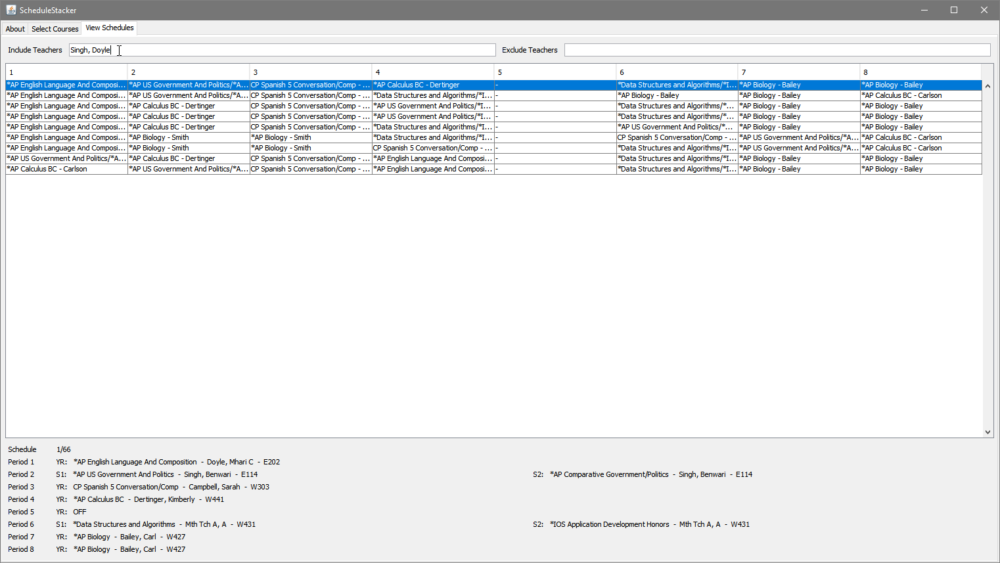

**YOU NEED A COMPUTER WITH JAVA (YOU PROBABLY ALREADY HAVE IT)**  
**DOWNLOAD JAR AND CSV UNDER LATEST. RUN JAR FILE. FOLLOW DIRECTIONS BELOW**

ScheduleStacker is tool for finding all permutations of course schedules to aid in the self-registration process.  
Tell your friends! Tell everyone!!

### Downloads

#### Latest (v1.2.0)

ScheduleStacker: [v1.2.0](https://github.com/Coreball/ScheduleStacker/releases/download/v1.2.0/ScheduleStacker_v1.2.0.jar)  
Master Schedule: [2018-2019 CSV](https://github.com/Coreball/ScheduleStacker/releases/download/v1.1.0/MasterSchedule20182019.csv)

#### Older Versions

ScheduleStacker: [v1.1.0](https://github.com/Coreball/ScheduleStacker/releases/download/v1.1.0/ScheduleStacker_v1.1.0.jar)  
ScheduleStacker: [v1.0.0](https://github.com/Coreball/ScheduleStacker/releases/download/v1.0.0/ScheduleStacker_v1.0.0.jar)  
Master Schedule: [2017-2018 CSV](https://github.com/Coreball/ScheduleStacker/releases/download/v1.0.0/MasterSchedule20172018.csv)  
Master Schedule: [2017-2018 TXT](https://github.com/Coreball/ScheduleStacker/releases/download/v1.0.0/MasterSchedule20172018.txt)

[Changelog](https://github.com/Coreball/ScheduleStacker/releases)

### Usage

1. Navigate to the "Select Courses" tab and select the file containing the readable Master Schedule CSV (you just downloaded this) and load it.

2. Select your desired off periods. These are the off periods that you _like, totally need_. Depending on your situation, this could either be just your lunch period or your lunch period and another off that you'd like. If you have a one-and-a-half period class like AP Biology, do not treat the half period as a desired off period. If you select fewer off periods than the maximum possible, like if you only selected Period 5 but you have space for two off periods, the program will wildcard the remaining off periods.

3. Select your desired courses. CTRL-Click to select multiple in the same category or to deselect a course.

4. Press "Find Schedules" to generate the schedules.

5. Switch to "View Schedules" and explore the choices available to you. The details pane contains information including the teacher's full name and the classroom location.

6. You can type the name of specific teachers you want shown and ones you do not want shown into the include and exclude fields at the top. Also PROTIP: You can copy-paste rows into your favorite spreadsheet software.

### Help

I can't figure out how to select multiple courses in the same box  
- Hold CTRL and click  

Can't be opened because it is from an unidentified developer
- Try opening terminal and going to wherever you downloaded the .jar with `cd [Path to folder where .jar was saved]`. Run it directly with `java -jar ScheduleStacker_v1.2.0.jar`

It doesn't WORK!  
- Contact me with whatever issues you're experiencing. I want to help!  

### About

[GitHub Repository](https://github.com/Coreball/ScheduleStacker)  

[Additional Information](https://youtu.be/dQw4w9WgXcQ)

Created by Changyuan Lin [@Coreball](https://github.com/Coreball)  
Email: <clin3@cherrycreekschools.org>
