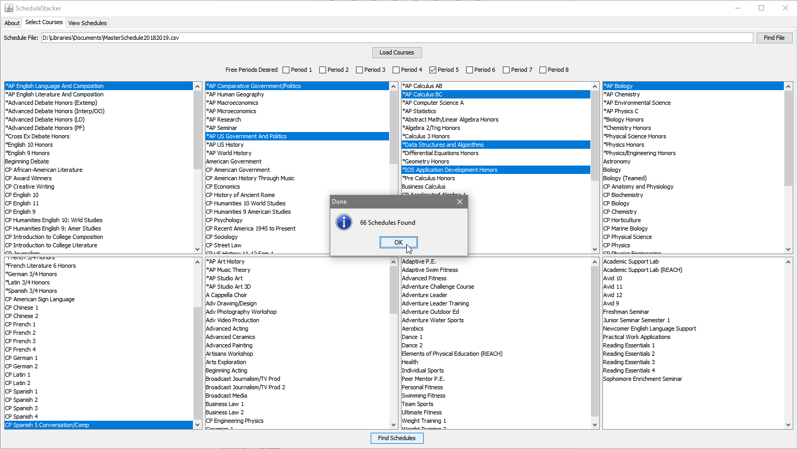

**YOU NEED A COMPUTER WITH JAVA INSTALLED (YOU PROBABLY ALREADY HAVE IT)**  
**DOWNLOAD LATEST JAR AND CSV BELOW. RUN JAR FILE. FOLLOW DIRECTIONS BELOW**

ScheduleStacker is tool for finding all permutations of course schedules to aid in the self-registration process.  

Tell your friends!

ScheduleStacker works by reading in a file containing the courses offered and storing them and their information in an internal data structure. The user selects some of the courses offered, and these get passed to the program, which then generates all potential schedules with the selected courses and off periods. These schedules are then displayed in an output table for the user to view, and the user can filter and sort them as needed. Because ScheduleStacker is written in Java, AP Computer Science students are encouraged to examine and/or build on the code if they are so inclined.

### Downloads

#### Latest (v1.2.1)

ScheduleStacker: [v1.2.1](https://github.com/Coreball/ScheduleStacker/releases/download/v1.2.1/ScheduleStacker_v1.2.1.jar)  
Master Schedule: [2019-2020 CSV](https://github.com/Coreball/ScheduleStacker/releases/download/v1.2.1/MasterSchedule20192020.csv)

#### Older Versions

ScheduleStacker: [v1.2.0](https://github.com/Coreball/ScheduleStacker/releases/download/v1.2.0/ScheduleStacker_v1.2.0.jar)  
ScheduleStacker: [v1.1.0](https://github.com/Coreball/ScheduleStacker/releases/download/v1.1.0/ScheduleStacker_v1.1.0.jar)  
ScheduleStacker: [v1.0.0](https://github.com/Coreball/ScheduleStacker/releases/download/v1.0.0/ScheduleStacker_v1.0.0.jar)  
Master Schedule: [2018-2019 CSV](https://github.com/Coreball/ScheduleStacker/releases/download/v1.1.0/MasterSchedule20182019.csv)  
Master Schedule: [2017-2018 CSV](https://github.com/Coreball/ScheduleStacker/releases/download/v1.0.0/MasterSchedule20172018.csv)  
Master Schedule: [2017-2018 TXT](https://github.com/Coreball/ScheduleStacker/releases/download/v1.0.0/MasterSchedule20172018.txt)

[Changelog](https://github.com/Coreball/ScheduleStacker/releases)

### Usage

1. Navigate to the "Select Courses" tab and select the file containing the readable Master Schedule CSV (you just downloaded this and saved it, right) and load it. CSV files can also be manually examined in your favorite spreadsheet software if you so please.

2. Select your desired off periods. These are the off periods that you like, _totally need_. Depending on your situation, this could either be just your lunch period or your lunch period and another off that you'd like. If you have a one-and-a-half period class like AP Biology or AP Physics C, do not treat the half period as a desired off period, leave it unselected. If you select fewer off periods than the maximum possible, like if you only selected Period 5 but you have space for two off periods, the program will wildcard the remaining off periods, meaning the results table will include schedules with all off combinations.

3. Select your desired courses. Hold CTRL and click (CTRL-Click) to select multiple courses in the same category or to deselect a course.

4. Press "Find Schedules" at the bottom to generate the schedules.

5. Switch to "View Schedules" up top and explore the choices available to you. The details pane contains information including the teacher's full name and the classroom location, as well as semester details.

6. You can type the last name of specific teachers you want shown and ones you do not want shown into the include and exclude fields at the top. Separate them with commas, spaces don't matter. You can also copy and paste schedule rows into your favorite spreadsheet software.

### Help

I can't figure out how to select multiple courses in the same box, or how to deselect a course  
- Hold CTRL and click  

The JAR can't be opened because it is from an unidentified developer
- Try opening terminal and going to wherever you downloaded the .jar with `cd [Insert path to folder where .jar was saved]`. Run it directly with `java -jar ScheduleStacker_v1.2.1.jar`

It doesn't WORK!  
- Contact me with whatever issues you're experiencing. I want to help!  

### About

[GitHub Repository](https://github.com/Coreball/ScheduleStacker)  

[Additional Information](https://youtu.be/dQw4w9WgXcQ)

Created by Changyuan Lin [@Coreball](https://github.com/Coreball)  
Email: <clin3@cherrycreekschools.org>
