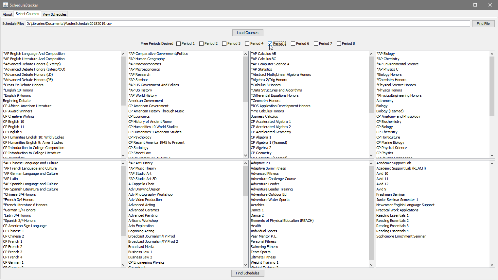
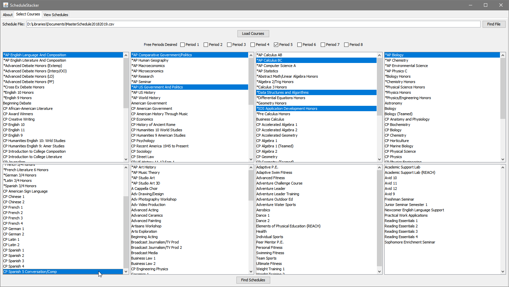

ScheduleStacker is tool for finding all permutations of course schedules to aid in the self-registration process.  
Tell your friends! Tell everyone!!

### Downloads

#### Latest (v1.1.0)

ScheduleStacker: [v1.1.0](https://github.com/Coreball/ScheduleStacker/releases/download/v1.1.0/ScheduleStacker_v1.1.0.jar)  
Master Schedule: [2018-2019 CSV](https://github.com/Coreball/ScheduleStacker/releases/download/v1.1.0/MasterSchedule20182019.csv)

#### Older Versions

ScheduleStacker: [v1.0.0](https://github.com/Coreball/ScheduleStacker/releases/download/v1.0.0/ScheduleStacker_v1.0.0.jar)  
Master Schedule: [2017-2018 CSV](https://github.com/Coreball/ScheduleStacker/releases/download/v1.0.0/MasterSchedule20172018.csv)  
Master Schedule: [2017-2018 TXT](https://github.com/Coreball/ScheduleStacker/releases/download/v1.0.0/MasterSchedule20172018.txt)

### Usage

1. Navigate to the "Select Courses" tab and select the file containing the readable Master Schedule CSV and load it.

2. Select your desired off periods. These are the off periods that you _like, totally need_. Depending on your situation, this could either be just your lunch period or your lunch period and another off that you'd like. If you have a one-and-a-half period class like AP Biology, do not treat the half period as a desired off period. If you select fewer off periods than the maximum possible, like if you only selected Period 5 but you have space for two off periods, the program will wildcard the remaining off periods.

3. Select your desired courses. CTRL-Click to select multiple in the same category or to deselect a course.

4. Press "Find Schedules" to generate the schedules.

5. Switch to "View Schedules" and explore the choices available to you. The details pane contains information including the teacher's full name and the classroom location.

### About

[GitHub Repository](https://github.com/Coreball/ScheduleStacker)

Created by Changyuan Lin [@Coreball](https://github.com/Coreball)  
Email: <clin3@cherrycreekschools.org>
